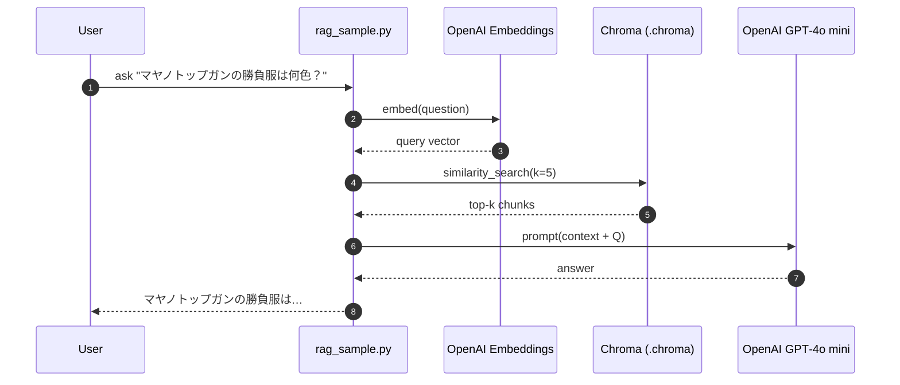

# `rag-aws-demo` – Architecture & Data Flow

このドキュメントは、GitHub リポジトリ **[`rag-aws-demo`](https://github.com/your-name/rag-aws-demo)** に格納されたウマ娘向け RAG システムの内部構成を図解します。  
対象読者は、すでに README の手順で EC2 + LangChain + Chroma を動かしたプログラマーです。

---

## 1. 論理ブロック図

```mermaid
flowchart TB
    subgraph EC2[Amazon EC2 t4g.small<br/>Amazon Linux 2023]
        direction TB
        D[docs/ *.txt] --> C1[Text Splitter<br/>(RecursiveCharacterTextSplitter)]
        C1 --> E1[OpenAI Embedding API]
        E1 --> VS[(Chroma Vector Store<br/>persist_directory=.chroma)]
        
        UQ[User Query (CLI / API)] --> EQ[Embed Query<br/>(OpenAI API)]
        EQ --> SR[Similarity Search<br/>Top‑k chunks]
        SR --> PB[Prompt Builder<br/>(context + query)]
        PB --> LLM[(OpenAI GPT‑4o mini)]
        LLM --> UA[Answer w/ citations]
    end
    VS -. disk(EBS gp3 20 GB) .- VS
```

**要点**  

| レイヤ       | コンポーネント                         | 備考 |
|--------------|---------------------------------------|------|
| **Ingestion**| Text Splitter → Embedding → Chroma    | `python rag_sample.py ingest` が実行 |
| **Storage**  | `.chroma/` ディレクトリ (DuckDB)      | 永続化；EBS 上に保存 |
| **Retrieval**| `similarity_search(k)`                | 既定 `k=5` (足りなければ自動縮小) |
| **Generation**| GPT‑4o mini                          | OpenAI API Key は `.env` |

---

## 2. クエリ処理シーケンス図



---

## 3. ファイル配置とポート

| パス / ポート | 役割 | 備考 |
|---------------|------|------|
| `~/rag-aws-demo/docs/` | 生テキスト (5 ファイル) | 追加で好きな数だけ投入可 |
| `.chroma/` | ベクトルストア (DuckDB + Parquet) | `persist_directory` に指定 |
| `.env` | `OPENAI_API_KEY` | `.gitignore` で除外必須 |
| `8000/tcp` | （任意）FastAPI endpoint | Security Group で MyIP のみに開放 |

---

## 4. 典型的なデータフロー

1. **Ingest**  
   `rag_sample.py ingest --docs_dir docs`  
   - チャンク ↝ 埋め込み ↝ Chroma 保存  
2. **Query**  
   `rag_sample.py ask "質問"` (または `/ask` API)  
   - 取得チャンク数 < `k` の場合は自動縮小  
   - 回答はコンテキストを参照して生成  
3. **Update**  
   `docs/` にテキスト追加 → 再度 `ingest` でベクトルを upsert

---

## 5. 拡張アイデア

| アイデア | 簡易メモ |
|----------|---------|
| **LLM Re‑Rank** | 取得上位20件 → GPT‑4o で再評価し Top5 を使用 |
| **要約コンテキスト** | チャンク長を削りたい場合、LLM で1‑sentence 要約してから Prompt へ |
| **Web UI** | EC2 上で Streamlit / Gradio → ポート 8501 に公開 |

---

Happy RAG Hacking! 🎉
