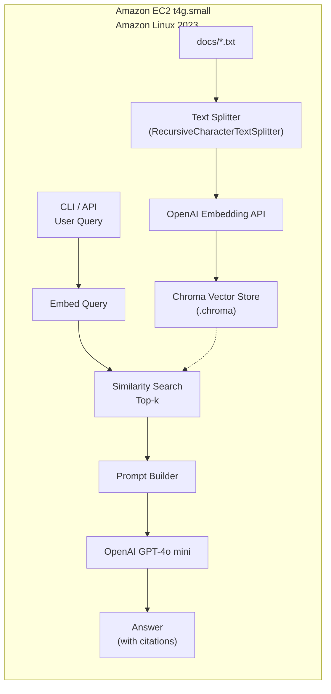
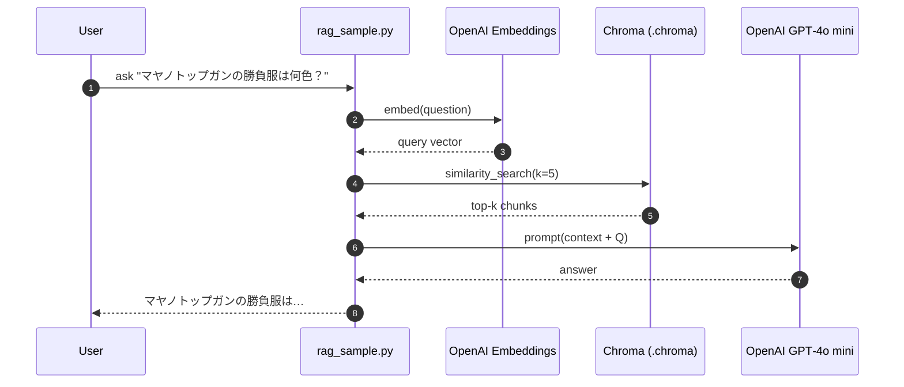
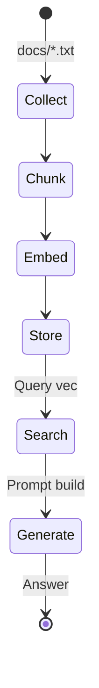

# `rag-aws-demo` – Architecture & Data Flow

このドキュメントは、GitHub リポジトリ **[`rag-aws-demo`](https://github.com/your-name/rag-aws-demo)** に格納されたウマ娘向け RAG システムの内部構成を図解します。  
対象読者は、すでに README の手順で EC2 + LangChain + Chroma を動かしたプログラマーです。

---

## 1. 論理ブロック図



**要点**  

| レイヤ       | コンポーネント                         | 備考 |
|--------------|---------------------------------------|------|
| **Ingestion**| Text Splitter → Embedding → Chroma    | `python rag_sample.py ingest` が実行 |
| **Storage**  | `.chroma/` ディレクトリ (DuckDB)      | 永続化；EBS 上に保存 |
| **Retrieval**| `similarity_search(k)`                | 既定 `k=5` (足りなければ自動縮小) |
| **Generation**| GPT‑4o mini                          | OpenAI API Key は `.env` |

---

## 2. クエリ処理シーケンス図



---

## 3. ファイル配置とポート

| パス / ポート | 役割 | 備考 |
|---------------|------|------|
| `~/rag-aws-demo/docs/` | 生テキスト (5 ファイル) | 追加で好きな数だけ投入可 |
| `.chroma/` | ベクトルストア (DuckDB + Parquet) | `persist_directory` に指定 |
| `.env` | `OPENAI_API_KEY` | `.gitignore` で除外必須 |
| `8000/tcp` | （任意）FastAPI endpoint | Security Group で MyIP のみに開放 |

---

## 4. 典型的なデータフロー

1. **Ingest**  
   `rag_sample.py ingest --docs_dir docs`  
   - チャンク ↝ 埋め込み ↝ Chroma 保存  
2. **Query**  
   `rag_sample.py ask "質問"` (または `/ask` API)  
   - 取得チャンク数 < `k` の場合は自動縮小  
   - 回答はコンテキストを参照して生成  
3. **Update**  
   `docs/` にテキスト追加 → 再度 `ingest` でベクトルを upsert

---

## 5. 拡張アイデア

| アイデア | 簡易メモ |
|----------|---------|
| **LLM Re‑Rank** | 取得上位20件 → GPT‑4o で再評価し Top5 を使用 |
| **要約コンテキスト** | チャンク長を削りたい場合、LLM で1‑sentence 要約してから Prompt へ |
| **Web UI** | EC2 上で Streamlit / Gradio → ポート 8501 に公開 |

---

Happy RAG Hacking! 🎉
---
## 6. RAG + LLM 動作原理を体系的に理解する

### 6.1 なぜ “検索してから生成” なのか
| チャレンジ | 従来 (LLM 単体) | RAG アプローチ |
|------------|----------------|----------------|
| **最新情報を答えたい** | モデル再学習が必要 | 外部コーパスを毎回検索 |
| **長い社内ドキュメント** | 128 k トークン上限 | 必要部分だけチャンクで注入 |
| **ハルシネーション** | 推測が増える | 参照元を添付して根拠を示す |

**核心**: *LLM は「圧縮した言語知識」を持つが、「可変で巨大な業務知識」は持たない*。RAG で両者を分業させる。

### 6.2 Five‑step ルールで覚える RAG （`rag_sample.py` 実装と対応）

| ステップ | キーワード | 本デモの処理 | 説明 |
|---------|-----------|-------------|------|
| ① Collect | 原文収集 | `docs/*.txt` | ゲーム設定を保存 |
| ② Chunk   | 分割      | `RecursiveCharacterTextSplitter` | ~400 token 重複 10 % |
| ③ Embed   | ベクトル化| `OpenAIEmbeddings` | 1536‑次元ベクトル |
| ④ Store & Search | 検索 | `Chroma.similarity_search` | Top‑k 類似チャンク |
| ⑤ Generate | 生成 | `ChatOpenAI.invoke` | Prompt = context + query |

<details><summary>図解（クリック）</summary>


</details>

### 6.3 ベクトル検索の裏側（コサイン類似度）

チャンク $x$ と 質問 $q$ の埋め込みベクトルを **$\mathbf{x}, \mathbf{q}$** とすると，

$$
\mathrm{sim}(\mathbf{x},\mathbf{q}) = \frac{\mathbf{x}\cdot\mathbf{q}}{\|\mathbf{x}\|\,\|\mathbf{q}\|}
$$

- 1 に近いほど意味が近い  
- Chroma(DuckDB) は内積降順で並べ替え。  
- `k` を下げる＝precision ↑／`k` を上げる＝recall ↑。

### 6.4 Prompt Engineering の雛形

```text
=== Reference ===
<chunk1>

<chunk2>
=== Question ===
{ユーザ質問}
=== Answer ===
```

1. セクションマーカーで文脈を明示  
2. 引用が長すぎる場合は `map_reduce` で要約  
3. 引用番号を付ければ根拠付き回答が可能

### 6.5 品質を測る

1. `eval/queries.tsv` に「質問\t期待キーワード」を10件作る  
2. スクリプトで RAG 呼び出し → BLEU/Hits@k を計算  
3. `chunk_size`・`k` を変えて A/B テスト

### 6.6 実践的な拡張

| 機能 | 道具 |
|------|------|
| 自動 ingest | GitHub Actions + `langchain.document_loaders.GitLoader` |
| Re‑rank 2段 | `ContextualCompressionRetriever` |
| Web UI | Streamlit / Gradio |
| データ権限 | metadata フィルタリング |

### 6.7 まとめ
- RAG = **オフラインで知識をベクトル化** + **オンラインで関連チャンク注入**  
- LLM は推論機、Vector Store は知識庫 —— 分業がスケールの鍵  
- `rag-aws-demo` は最小 150 行で RAG の本質を体験できる

Happy studying! 🚀
